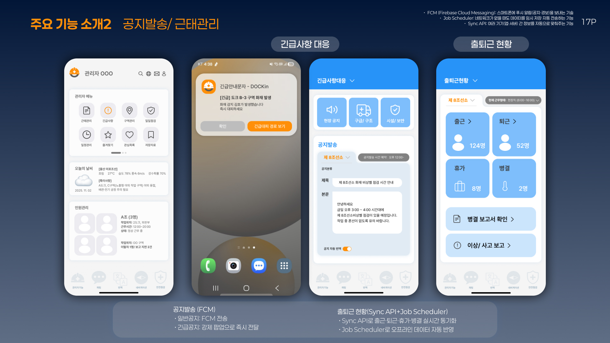
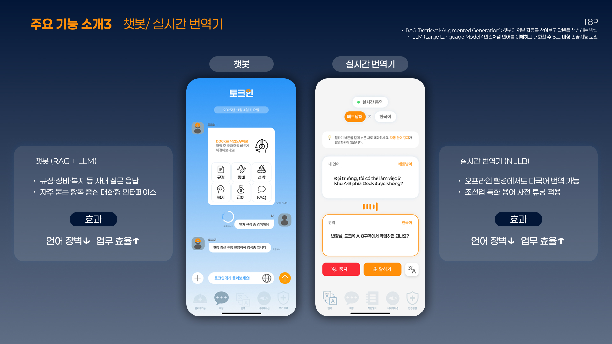
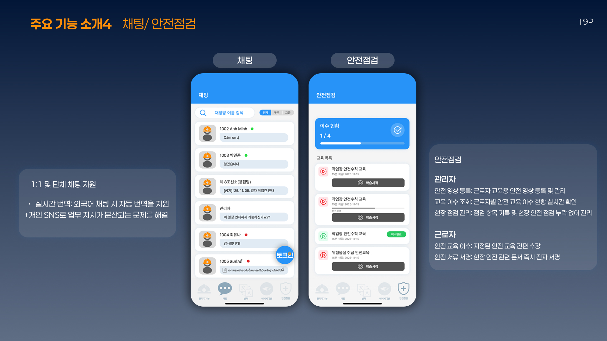
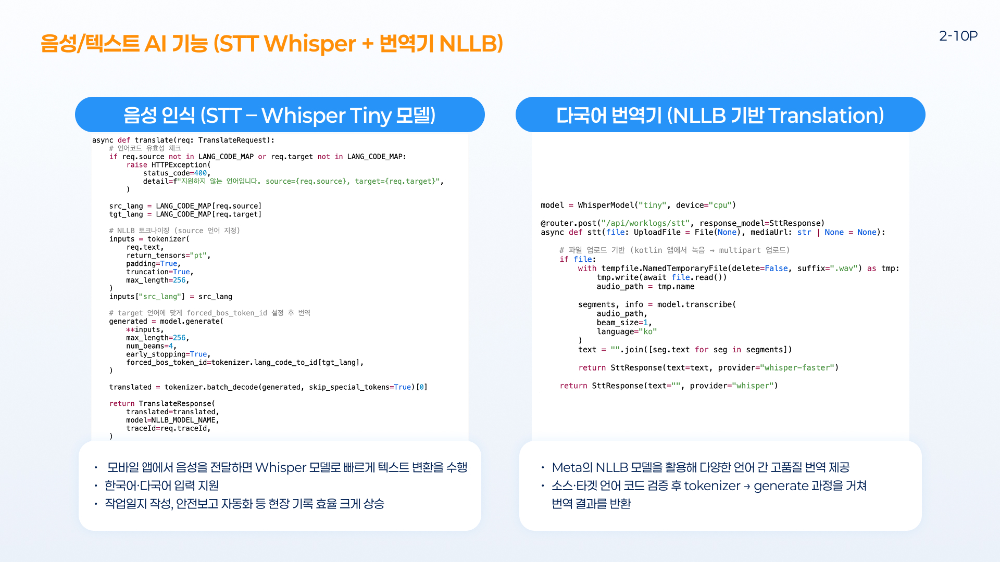

<div align="center">


# DOCKin
**조선소 현장용 AR·AI 안전/업무 보조 앱** *2025 K-조선 해커톤 프로젝트 대상 (산업통상자원부 주최)*

<br />

[**App Repo »**](https://github.com/DOCKin-project/DOCKin-app) &nbsp; | &nbsp;
[**Backend Repo »**](https://github.com/DOCKin-project/DOCKin-backend) &nbsp; | &nbsp; 
[**AI Server Repo »**](https://github.com/DOCKin-project/DOCKin-aiserver)

</div>

## 📑 목차
1. [🔍 프로젝트 개요](#-프로젝트-개요)
2. [🏗️ 전체 개발 구조](#️-전체-개발-구조)
3. [📂 Directory Structure](#-directory-structure)
4. [📖 API Documentation](#-api-documentation)
5. [📂 Database](#-database)
6. [🎥 시연 영상](#-시연-영상)
7. [✨ 핵심 기능](#-핵심-기능)
8. [🛠️ 기술 스택](#️-기술-스택)
9. [💻 주요 구현 코드](#-주요-구현-코드)
10. [👥 팀원 소개](#-팀원-소개)


--- 
### 개발 기간 
- 기획 기간(예선): 2025.09 ~ 2025.10
- 본선 개발 기간: 2025.10 ~ 2025.11
- 리팩토링 기간 : 2026. 01 ~ ing
---

## 🔍 프로젝트 개요 
DOCKin은 조선소 근로자를 위한 AR 기반 작업 안내, AI 음성 인식, 다국어 번역, 안전·근태 관리를 통합한 모바일 앱입니다.  
실제 조선 현장에서 자주 발생하는 문제(언어 장벽, 보고 누락, 위치 혼선)를 기술로 해결하는 것을 목표로 합니다.

---

## 🏗️ 전체 개발 구조 ]


## 📂 Directory Structure 

<details>
<summary><b>📂 백엔드 상세 폴더 구조 보기 (Project Structure)</b></summary>
<br />

```bash
[ DOCKin-spring ]
├── .github/workflows       # CI/CD 자동화 (GitHub Actions)
├── nginx/conf.d            # Nginx 리버스 프록시 및 서버 설정
├── src/main/java/com/DOCKin
│   ├── ai                  # AI 연동 모듈 (FastAPI, STT, 번역 연동)
│   │   ├── controller      # AI 기능 API 엔드포인트
│   │   ├── dto             # 데이터 전송 객체
│   │   ├── model           # AI 히스토리 및 로그 엔티티
│   │   └── service         # FastAPI 서비스 연동 로직
│   ├── attendance          # 근태 관리 시스템 (출퇴근 기록)
│   ├── chat                # 실시간 채팅 (WebSocket/STOMP 기반)
│   ├── member              # 회원 및 인증 시스템 (JWT/Security)
│   ├── global              # 글로벌 설정 (Security, WebSocket, Error Handling)
│   │   ├── config          # 주요 Bean 및 프로토콜 설정
│   │   ├── security        # JWT 기반 인증/인가 로직
│   │   └── util            # 오디오 컨버터 등 공통 유틸리티
│   ├── safetyCourse        # 안전 교육 관리 시스템
│   └── worklog             # 작업 일지 및 코멘트 시스템
├── src/main/resources
│   ├── application.properties  # 앱 환경 설정
│   └── schema.sql              # DB 스키마 정의
├── compose.yaml            # Docker 인프라 구성
└── Dockerfile              # 백엔드 컨테이너 빌드 설정

```
</details>


## 📂 API Documentation 

<details>
<summary><b>📂 상세 API 엔드포인트 보기 (Endpoints Specification)</b></summary>
<br />

### 👤 인증 및 계정 (Auth)
| Method | Endpoint | Description |
| :--- | :--- | :--- |
| `POST` | `/member/signup` | 회원가입 |
| `POST` | `/member/login` | 로그인 및 JWT 토큰 발급 |
| `POST` | `/member/logout` | 로그아웃 (토큰 무효화) |
| `DELETE` | `/member/{userId}` | 회원 탈퇴 |

### 🤖 AI 및 스마트 연동 (AI / STT)
| Method | Endpoint | Description |
| :--- | :--- | :--- |
| `POST` | `/api/work-logs/stt` | **음성 파일 기반 작업일지 생성 (STT)** |
| `POST` | `/api/ai/rt-translate` | STT 실시간 번역 연동 |
| `POST` | `/api/ai/translate/{logId}` | 작업일지 다국어 번역 요청 |
| `POST` | `/api/ai/chatbot` | 현장 안전 가이드 챗봇 |

### 📝 작업일지 및 댓글 (Work Logs & Comments)
| Method | Endpoint | Description |
| :--- | :--- | :--- |
| `GET` | `/api/work-logs` | 전체 작업일지 목록 조회 (Paging) |
| `POST` | `/api/work-logs` | 일반 텍스트 기반 일지 생성 |
| `GET` | `/api/work-logs/search` | 키워드 활용 게시물 검색 |
| `POST` | `/api/work-logs/{logId}/comments` | 관리자 피드백(댓글) 작성 |
| `PUT` | `/api/work-logs/{logId}` | 일지 내용 및 이미지 수정 |
| `DELETE` | `/api/work-logs/{logId}` | 작업일지 삭제 |

### 💬 실시간 소통 (Chat)
| Method | Endpoint | Description |
| :--- | :--- | :--- |
| `POST` | `/api/chat/room` | 협업 채팅방 신규 생성 |
| `GET` | `/api/chat/rooms` | 참여 중인 모든 채팅방 목록 |
| `GET` | `/api/chat/room/{roomId}/messages` | 채팅 내역 조회 (무한 스크롤) |
| `DELETE` | `/api/chat/room/leave/{roomId}` | 채팅방 나가기 |

### ⏰ 근태 및 안전 교육 (Attendance & Safety)
| Method | Endpoint | Description |
| :--- | :--- | :--- |
| `POST` | `/api/attendance/in` | 출근 기록 등록 (위치/시간) |
| `POST` | `/api/attendance/out` | 퇴근 기록 등록 |
| `GET` | `/api/safety/user/training/uncompleted` | 미이수 안전 교육 목록 확인 |
| `PATCH` | `/api/safety/user/training/complete` | 교육 영상 이수 완료 처리 |

</details>

## 📂 Database 

<details>
<summary><b>📂 MySQL</b></summary>
<br />

> 추후 ERD 및 테이블 명세서가 이곳에 추가될 예정입니다.

</details>


---


## 🎥 시연 영상 


---

## ✨ 핵심 기능






---

## 🛠️ 기술 스택 

### 📱 Front End
| 역할 | 종류 |
| :--- | :--- |
| **Framework** |  |
| **State** |   |
| **Language** |  |
| **Logic/Form** |    |
| **Deployment** |  |

### ⚙️ Back End
| 역할               | 종류                                                                                                                                                                                                                                                                                                                                                                                                                                        |
|:-----------------|:------------------------------------------------------------------------------------------------------------------------------------------------------------------------------------------------------------------------------------------------------------------------------------------------------------------------------------------------------------------------------------------------------------------------------------------|
| **Framework**    |                                                                                                                                                                                                                                                                                                                        |
| **Language**     |                                                                                                                                                                                                                                                                                                                                         |
| **Database/ORM** |                                                                                                                                                                                                                                       |
| **Security**     |                                                                                                                                                                                                |
| **Protocol**     |                                                                                                                                                                                                                                                                                                                             |
| **Infra/CI/CD**  |     |
| **Storage**      |                                                                                                                                                                                                                                                                                                                              |   


### 🤖 AI & Data
| 역할 | 종류                                                                                                                                                                                                                             |
| :--- |:-------------------------------------------------------------------------------------------------------------------------------------------------------------------------------------------------------------------------------|
| **Framework** |                |
| **Models** |  |
| **Pipeline** |    |


## 💻 주요 구현 코드 



---

## 👥 팀원 소개

| [**권효재**](https://github.com/Khyojae) | [**박민정**](https://github.com/emfpdlzj) |
| :---: | :---: |
| <a href="https://github.com/Khyojae"></a> | <a href="https://github.com/emfpdlzj"></a> |
| **Backend & Infra** | **Frontend & AI  & Infra** |
